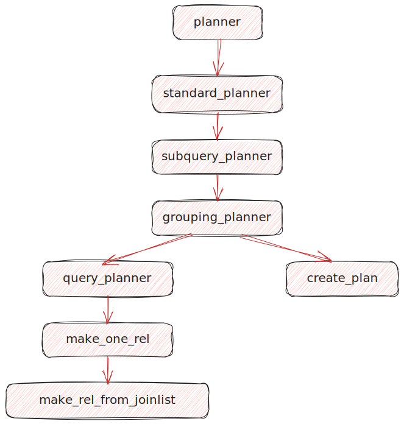

# 优化器概览

本章基于 PostgreSQL 源码中的 `src/backend/optimizer/README`，简要介绍查询优化器（Query Optimizer）的整体工作流程和核心函数调用链。

优化器的主要任务是接收查询树（Query Tree），并生成最优的执行计划（Plan）。

## 核心调用流程

PostgreSQL 优化器的入口函数位于 `src/backend/optimizer/plan/planner.c`。

整个规划过程大致可以分为以下几个层级：

### 1. `planner()`
这是优化器的全局入口点。它的主要职责为：
*   如果配置了钩子函数（`planner_hook`），则调用钩子。
*   否则，调用默认的优化器实现 `standard_planner()`。

### 2. `standard_planner()`
这是标准的优化策略入口。它的工作包括：
*   **游标与参数设置**：处理 `CURSOR` 或其他上下文导致的相关标志。
*   **预处理**：调用 `subquery_planner` 来处理顶层查询。
*   **计划清理**：在生成的计划树中，去除不需要的冗余节点，进行最终清理。

### 3. `subquery_planner()`
该函数负责处理一个特定的查询层级（Query Level）。对于包含子查询的 SQL，这个函数会被递归调用。
*   **重写与预处理**：处理 `ANY/ALL` 子链接，提升子查询（Pull-up sublinks/subqueries）。
*   **调用下层规划**：当查询树被扁平化或重写后，调用 `grouping_planner` 来进行实际的规划。

### 4. `grouping_planner()`
该函数负责处理查询的各个组成部分，包括：
*   处理 `GROUP BY`、`HAVING`、`WINDOW` functions、`DISTINCT` 和 `ORDER BY` 等非 Join 操作。
*   首先调用 `query_planner` 来计算基础的“扫描/连接”（Scan/Join）路径。
*   在 `query_planner` 返回的路径基础上，添加聚合（Aggregation）、排序（Sorting）和分组等上层节点。

### 5. `query_planner()`
这是优化器的核心函数，专注于 Scan/Join 阶段的优化。
*   **基础关系处理**：为查询中的每个基表（Base Relation）生成扫描路径（如 Seq Scan, Index Scan 等）。
*   **连接搜索**：调用 `make_one_rel()` 来搜索最优的表连接顺序。系统会使用动态规划（Dynamic Programming）或遗传算法（GEQO）来组合基础表，直到所有表组成一个最终的关系。

## 主要阶段总结

根据 `standard_planner` 的执行逻辑，优化过程可以概括为以下三个步骤：

1.  **预处理 (Preprocessing)**:
    *   重写子查询，调用 `eval_const_expressions` 化简常量表达式。
    *   消除无用的外连接（Outer Join Elimination）。
    *   分发和处理约束条件（Qualifiers）。

2.  **扫描/连接规划 (Scan/Join Planning)**:
    *   为基表生成访问路径。
    *   计算两表连接、三表连接等，直到生成包含所有表的连接路径。
    *   这部分主要由 `query_planner` 和 `make_one_rel` 完成。

3.  **后置处理 (Post-processing)**:
    *   在连接结果之上，添加 Grouping、Aggregation、Windowing 和 Sorting 等节点。
    *   将包含最优代价的 `Path` 树转换为最终的 `Plan` 树（`create_plan` 阶段）。

## 源码路径参考

*   **入口与流程控制**: `src/backend/optimizer/plan/planner.c`
*   **连接路径搜索**: `src/backend/optimizer/path/allpaths.c`, `src/backend/optimizer/path/joinpath.c`
*   **动态规划算法**: `src/backend/optimizer/path/joinrels.c`
*   **计划节点生成**: `src/backend/optimizer/plan/createplan.c`
